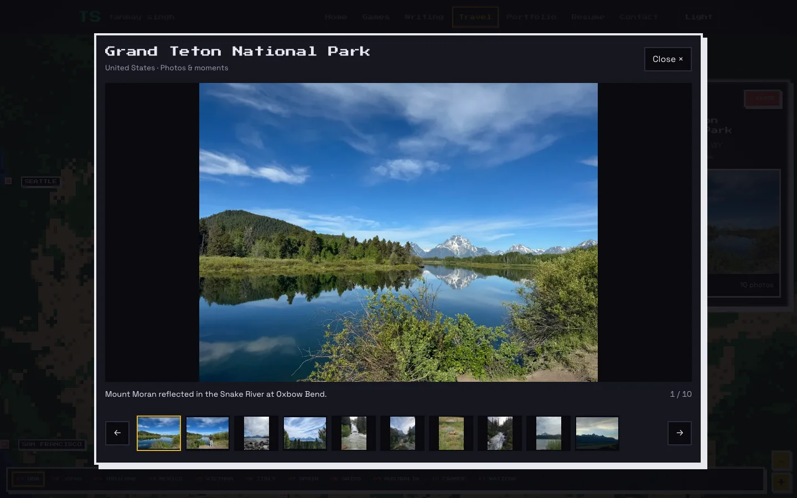

# Expanded travel galleries

This expansion adds 69 reviewed photographs. The catalog now contains 132 photographs
and one existing silent golf video across 34 destinations. Public media,
including the video poster, totals 51,892,816 bytes (49.49 MiB).

Seven destinations established by photo evidence now have canonical pins: Grand Teton
National Park, Yellowstone National Park, Teton Village, Rocky Mountain National Park,
Wengen, Jungfraujoch, and Interlaken. They have no synthetic Timeline visit counts or
dwell time. Existing travel history, Ko Phangan before Ko Samui, and all seven residence
classifications are preserved. Updated statistics reflect 124 places, including 94 in
the United States.

| Destination | Photos | Videos |
| --- | ---: | ---: |
| Seattle | 4 | 0 |
| Las Vegas | 4 | 0 |
| Los Angeles | 1 | 0 |
| Nashville | 1 | 0 |
| Lake Placid | 1 | 0 |
| New Orleans | 2 | 0 |
| Granby | 1 | 0 |
| Jackson | 1 | 0 |
| Breckenridge | 1 | 0 |
| Grand Canyon | 3 | 0 |
| Tokyo | 6 | 0 |
| Kyoto | 1 | 0 |
| Osaka | 1 | 0 |
| Bangkok | 7 | 0 |
| Chiang Mai | 11 | 0 |
| Ko Phangan | 11 | 0 |
| Ko Samui | 4 | 0 |
| Ninh Bình | 14 | 1 |
| Hanoi | 8 | 0 |
| Venice | 3 | 0 |
| Florence | 2 | 0 |
| Rome | 3 | 0 |
| San Gimignano | 1 | 0 |
| Madrid | 4 | 0 |
| Barcelona | 3 | 0 |
| Paris | 6 | 0 |
| Vatican | 4 | 0 |
| Wengen | 3 | 0 |
| Jungfraujoch | 1 | 0 |
| Interlaken | 1 | 0 |
| Rocky Mountain National Park | 2 | 0 |
| Grand Teton National Park | 10 | 0 |
| Yellowstone National Park | 5 | 0 |
| Teton Village | 2 | 0 |

Images retain original framing and appearance. Public copies are local WebP assets
with a maximum edge of 1,800 pixels and stripped sensitive metadata. Originals,
Google Photos source links, review decisions, and the evolving picking guide remain
in ignored `travel-studio/media-review/`. Portraits use explicit existing Tanmay labels
and a visual quality review; no people were cropped or edited out.

The existing accessible gallery provides responsive images, lazy loading, keyboard
navigation, focus restoration, and click-to-play video. This change expands its data
and assets while preserving map and gallery behavior.

## Validation

- Production build passed, including type checking. Twelve existing lint warnings
  remain in unrelated game files.
- All 124 unit tests passed, including canonical mapping, local file availability,
  image dimensions, metadata removal, and per-file/total size limits.
- All 19 existing travel Playwright tests passed against the production build,
  including mobile navigation, keyboard behavior, map gestures and reduced motion.
- Pan runs recorded desktop long tasks of 69 and 81 ms, and one mobile task of 124 ms.
  Interaction assertions passed; this run does not establish zero-jank performance.
- The additional Grand Teton gallery test passed on desktop and mobile (20 total).
  Representative screenshots were visually inspected.

## Review still outstanding

This draft is a reviewed expansion, not an exhaustive photo-library audit. The target
of roughly ten public photos and thirty private originals has not been reached for
most destinations. Japan and Thailand/Vietnam need further expansion, as do remaining
US trips and date gaps in Europe. Some downloaded images remain private because their
source mapping or small background details are uncertain.

Searches in Chicago, St. Louis, San Diego, Detroit, Mexico and Shreveport did not yield
eligible public selections. Sydney results did not reliably establish the location.
Corpus Christi has promising museum candidates, but selection/download was not verified
before browser and native Chrome control failed. Exact search coverage and restart
points are saved privately; no destination is marked fully reviewed merely from a query.

No additional videos are public. Pending clips still need full visual and audio review.
The ATV original is retained privately because it contains two riders, which conflicts
with the people rule. Downloaded Live Photo companions are not counted as reviewed videos.

iCloud review remains deferred, including Japan, and personal-library backup completeness
has not been established. Shared albums are excluded from the requested backup scope.
Neither photo library was modified, reorganized, or shared. No merge or deployment was
performed by the agent.
