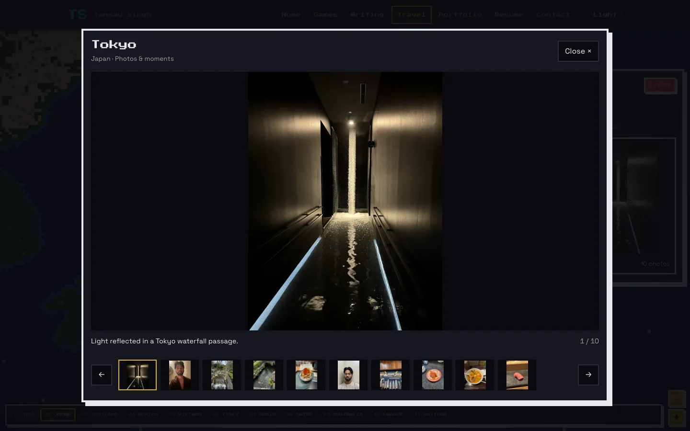
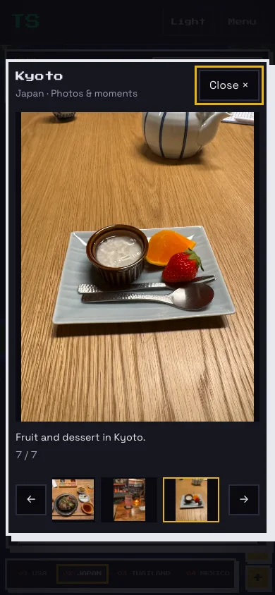
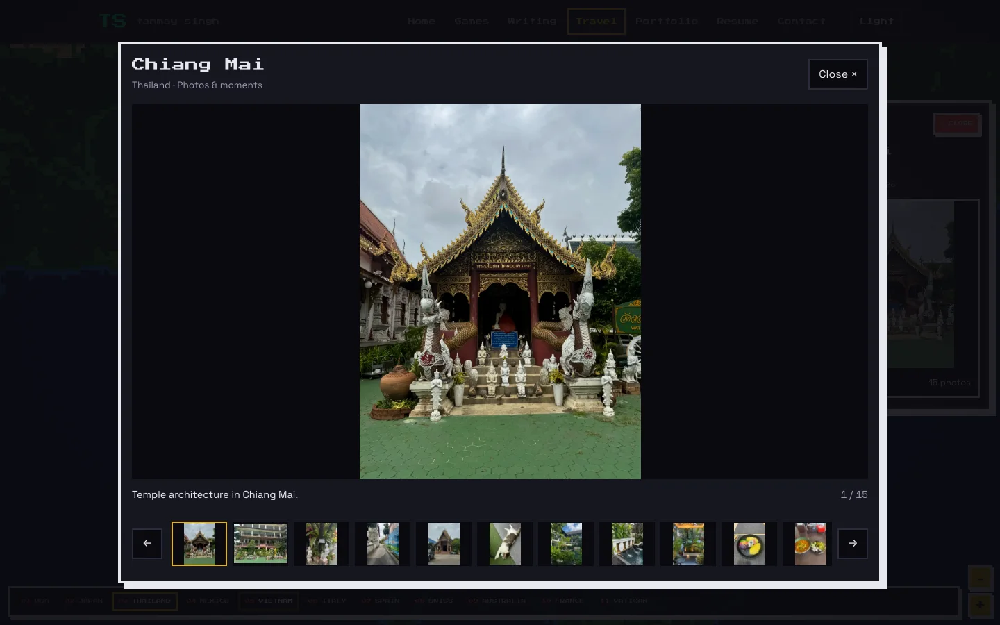
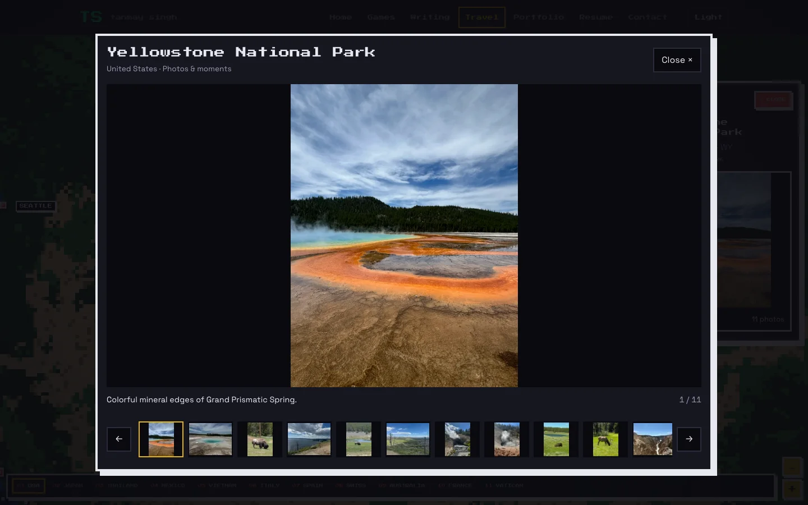
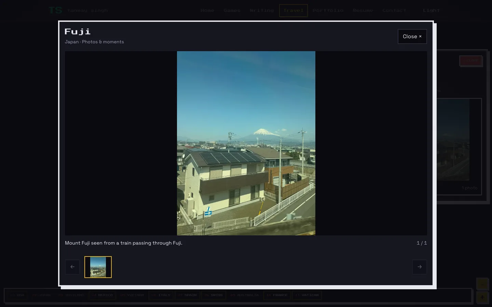
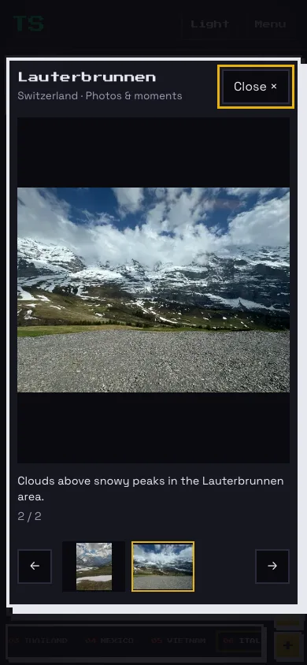
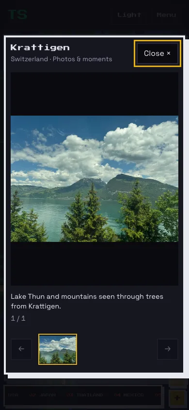
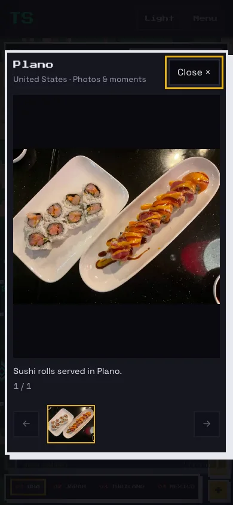
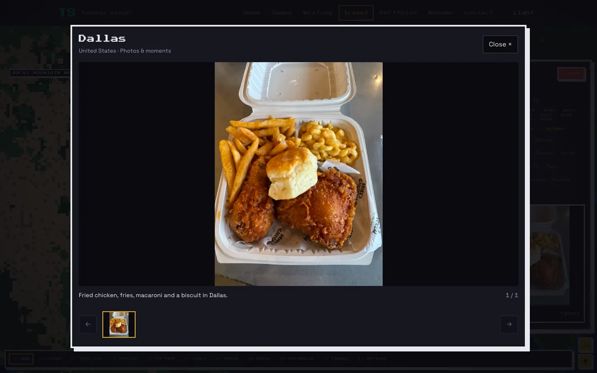

# Expanded travel galleries

This expansion adds 117 reviewed photographs. The catalog now contains 180 photographs
and one existing silent golf video across 46 destinations. Public media,
including the video poster, totals 75,224,394 bytes (71.74 MiB).

Eleven destinations established by photo evidence now have canonical pins: Grand Teton
National Park, Yellowstone National Park, Teton Village, Rocky Mountain National Park,
Wengen, Jungfraujoch, Interlaken, Leissigen, Fuji, Lauterbrunnen, and Krattigen. They have no synthetic Timeline visit counts or
dwell time. Existing travel history, Ko Phangan before Ko Samui, and all seven residence
classifications are preserved. Updated statistics reflect 128 places, including 94 in
the United States.

| Destination | Photos | Videos |
| --- | ---: | ---: |
| Seattle | 4 | 0 |
| Las Vegas | 4 | 0 |
| Los Angeles | 1 | 0 |
| Nashville | 1 | 0 |
| Lake Placid | 1 | 0 |
| New Orleans | 2 | 0 |
| Granby | 1 | 0 |
| Jackson | 1 | 0 |
| Breckenridge | 1 | 0 |
| Grand Canyon | 4 | 0 |
| Corpus Christi | 1 | 0 |
| Tokyo | 10 | 0 |
| Kyoto | 7 | 0 |
| Osaka | 3 | 0 |
| Bangkok | 7 | 0 |
| Chiang Mai | 15 | 0 |
| Ko Phangan | 14 | 0 |
| Ko Samui | 4 | 0 |
| Ninh Bình | 14 | 1 |
| Hanoi | 8 | 0 |
| Venice | 4 | 0 |
| Florence | 2 | 0 |
| Rome | 4 | 0 |
| San Gimignano | 1 | 0 |
| Madrid | 4 | 0 |
| Barcelona | 3 | 0 |
| Paris | 6 | 0 |
| Vatican | 5 | 0 |
| Wengen | 3 | 0 |
| Jungfraujoch | 2 | 0 |
| Interlaken | 1 | 0 |
| Rocky Mountain National Park | 2 | 0 |
| Grand Teton National Park | 10 | 0 |
| Yellowstone National Park | 11 | 0 |
| Leissigen | 1 | 0 |
| Santa Cruz | 2 | 0 |
| Glen Rose | 3 | 0 |
| Houston | 3 | 0 |
| Gun Barrel City | 1 | 0 |
| Teton Village | 2 | 0 |
| Fuji | 1 | 0 |
| Lauterbrunnen | 2 | 0 |
| Krattigen | 1 | 0 |
| Alvord | 1 | 0 |
| Plano | 1 | 0 |
| Dallas | 1 | 0 |

Images retain original framing and appearance. Public copies are local WebP assets
with a maximum edge of 1,800 pixels and stripped sensitive metadata. Originals,
Google Photos source links, review decisions, and the evolving picking guide remain
in ignored `travel-studio/media-review/`. Portraits use explicit existing Tanmay labels
and a visual quality review; no people were cropped or edited out.

The existing accessible gallery provides responsive images, lazy loading, keyboard
navigation, focus restoration, and click-to-play video. This change expands its data
and assets while preserving map and gallery behavior.

## Validation

- Production build passed, including type checking; 12 pre-existing lint warnings remain in unrelated games.
- All 126 unit tests passed, including canonical mappings, local asset availability, dimensions, metadata removal and media size budgets.
- All 33 travel Playwright tests passed against the final production build. Coverage includes desktop/mobile gallery loading, keyboard navigation, focus restoration, map gestures, contextual statistics and reduced motion.
- No tasks over 50 ms were observed during the final desktop/mobile pan measurements. This is a local measurement, not a guarantee of zero jank.
- Representative screenshots below were visually inspected.

## Selection coverage and exclusions

The private checklist records a named-location or dated-trip selection pass for all
121 canonical non-residence destinations. Broad location searches were supplemented
with chronological date grids and nearby locations; promising candidates were opened
and their downloaded originals inspected. Google indexing and search results do not
establish an exhaustive item-by-item library audit.

There are 539 downloaded source files in ignored local storage, including Live Photo
companions and rejected/private alternatives. The target of roughly ten public photos
and thirty private originals remains quality-dependent and was not reached for most
places. Seventy-five destinations have no approved media. No unrelated image was used
to fill them. Sources, capture dates, rationale, exclusions and query coverage remain
in private manifests and the durable picking guide.

Notable gaps include Chicago, St. Louis, San Diego, Detroit, Cancún and Playa del Carmen,
where reviewed candidates contained people or private material; Sydney has no reliable
eligible location match. Ōmachi and Nagano remain empty: the ramen photo was in Hakuba,
and station clips show passengers. Grindelwald and Durant candidates remain private
because of reflections or uncertain exact mapping. Ko Samui remains at four photos
because the additional seaside and airport candidates contained people.

The latest pass establishes Fuji, Lauterbrunnen and Krattigen from Google Photos Info
and adds an Alpine display at Jungfraujoch. It also adds verified Alvord, Plano and Dallas
food photographs. Fuji is separate from Tokyo; Krattigen and Lauterbrunnen are separate
from Thun. No synthetic Timeline counts or dwell time were assigned.

No additional videos are public. Full audio review was unavailable in this session,
so new clips remain private even where their visuals were promising. An audio-stream
survey covered 148 saved clips under 50 MB; 139 short clips were decoded throughout
to test for silence. Only one was exactly silent, and its associated scene had already
failed the people review. This technical check is not a substitute for listening.
The ATV original contains two riders and fails the people rule. Bonfire candidates
and downloaded Live Photo companions remain private and unapproved.

iCloud is deferred at the user’s request, and iCloud-to-Google backup completeness is
unverified. Shared albums remain outside the requested backup scope. Neither photo
library was modified, reorganized or shared. No merge or deployment was performed
by the agent.

## Destinations without approved media

These locations were checked in the documented query pass but have no eligible, confidently mapped public selection. Exact search scope and individual exclusions remain private.

| Country | Destinations |
| --- | --- |
| US | Albany, Arlington, Aurora, Baton Rouge, Beaumont, Brenham, Canton, Canyon Lake, Chicago, College Station, Columbus, Corsicana, Cypress, DeSoto, Dearborn, Denton, Denver, Detroit, Durant, Fairplay, Fort Worth, Fredericksburg, Fremont, Frisco (CO), Frisco (TX), Gainesville, Garland, Georgetown, Giddings, Henderson, Hillsboro, Irving, Jennings, Ken Caryl, Lakewood, Long Beach, Mansfield, Marlboro, Moose Wilson Road, New Braunfels, New Haven, Oceanside, Orange, Poughkeepsie, Rockwall, Round Rock, Rowlett, San Antonio, San Diego, San Francisco, San Jose, San Marcos, Seven Points, Shreveport, South Padre Island, St. Louis, Temple, The Villages, The Woodlands, Tool, Tyler, Van, Waco, Watsonville, Waxahachie, West, Williams |
| JP | Nagano, Ōmachi |
| MX | Cancún, Playa del Carmen |
| IT | Arezzo, Siena |
| CH | Thun |
| AU | Sydney |
