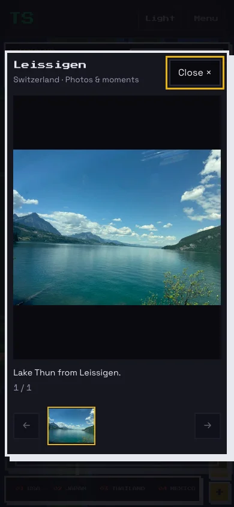

# Expanded travel galleries

This expansion adds 105 reviewed photographs. The catalog now contains 168 photographs
and one existing silent golf video across 38 destinations. Public media,
including the video poster, totals 71,439,644 bytes (68.13 MiB).

Eight destinations established by photo evidence now have canonical pins: Grand Teton
National Park, Yellowstone National Park, Teton Village, Rocky Mountain National Park,
Wengen, Jungfraujoch, Interlaken, and Leissigen. They have no synthetic Timeline visit counts or
dwell time. Existing travel history, Ko Phangan before Ko Samui, and all seven residence
classifications are preserved. Updated statistics reflect 125 places, including 94 in
the United States.

| Destination | Photos | Videos |
| --- | ---: | ---: |
| Seattle | 4 | 0 |
| Las Vegas | 4 | 0 |
| Los Angeles | 1 | 0 |
| Nashville | 1 | 0 |
| Lake Placid | 1 | 0 |
| New Orleans | 2 | 0 |
| Granby | 1 | 0 |
| Jackson | 1 | 0 |
| Breckenridge | 1 | 0 |
| Grand Canyon | 4 | 0 |
| Corpus Christi | 1 | 0 |
| Tokyo | 10 | 0 |
| Kyoto | 7 | 0 |
| Osaka | 3 | 0 |
| Bangkok | 7 | 0 |
| Chiang Mai | 15 | 0 |
| Ko Phangan | 14 | 0 |
| Ko Samui | 4 | 0 |
| Ninh Bình | 14 | 1 |
| Hanoi | 8 | 0 |
| Venice | 4 | 0 |
| Florence | 2 | 0 |
| Rome | 4 | 0 |
| San Gimignano | 1 | 0 |
| Madrid | 4 | 0 |
| Barcelona | 3 | 0 |
| Paris | 6 | 0 |
| Vatican | 5 | 0 |
| Wengen | 3 | 0 |
| Jungfraujoch | 1 | 0 |
| Interlaken | 1 | 0 |
| Rocky Mountain National Park | 2 | 0 |
| Grand Teton National Park | 10 | 0 |
| Yellowstone National Park | 11 | 0 |
| Leissigen | 1 | 0 |
| Santa Cruz | 2 | 0 |
| Glen Rose | 3 | 0 |
| Teton Village | 2 | 0 |

Images retain original framing and appearance. Public copies are local WebP assets
with a maximum edge of 1,800 pixels and stripped sensitive metadata. Originals,
Google Photos source links, review decisions, and the evolving picking guide remain
in ignored `travel-studio/media-review/`. Portraits use explicit existing Tanmay labels
and a visual quality review; no people were cropped or edited out.

The existing accessible gallery provides responsive images, lazy loading, keyboard
navigation, focus restoration, and click-to-play video. This change expands its data
and assets while preserving map and gallery behavior.

## Validation

- Production build passed, including type checking. Twelve existing lint warnings
  remain in unrelated game files.
- All 125 unit tests passed, including canonical mapping, local file availability,
  image dimensions, metadata removal, and per-file/total size limits.
- All 25 travel Playwright tests passed against the production build, including
  local galleries for Tokyo, Kyoto, Chiang Mai, Ko Phangan, Grand Teton, Yellowstone and Leissigen, mobile
  layout, keyboard navigation, focus restoration, map gestures and reduced motion.
- Pan runs recorded no desktop long tasks and one mobile task of 54 ms.
  Interaction assertions passed; this run does not establish zero-jank performance.
- Representative screenshots were visually inspected.

## Review still outstanding

This PR is a reviewed expansion, not an exhaustive photo-library audit. The target
of roughly ten public photos and thirty private originals has not been reached for
most destinations. The Japan March 2026 and Thailand September 2026 dated query grids were traversed
and expanded. Bangkok August, Rome and Venice date gaps were checked, as were
Corpus Christi, College Station, Tool, Colorado July 11, newer Los Angeles and
San Francisco trips. Date-only searches recovered Santa Cruz forest photos and Glen Rose wildlife; six missed Yellowstone stills were also recovered. South Padre, New Haven, Long Beach, Canyon Lake, Van, Durant and Fredericksburg queries were checked, with uncertain or ineligible candidates retained privately. Other US stops, Japan ski-area mapping and Swiss destinations
remain open; query coverage does not establish a complete library audit. Some downloaded images remain private because their
source mapping or small background details are uncertain.

Searches in Chicago, St. Louis, San Diego, Detroit, Mexico and Shreveport did not yield
eligible public selections. Sydney results did not reliably establish the location.
Corpus Christi now has one reviewed museum photograph. Ko Samui remains at four
images because new seaside and airport candidates contained background people.
College Station and Tool yielded no eligible additions in this pass. Exact search coverage and restart
points are saved privately; no destination is marked fully reviewed merely from a query.

No additional videos are public. Pending clips still need full visual and audio review;
audio input was unavailable in this session, so downloaded clips remain private.
The ATV original is retained privately because it contains two riders, which conflicts
with the people rule. Downloaded Live Photo companions are not counted as reviewed videos.

iCloud review remains deferred, including Japan, and personal-library backup completeness
has not been established. Shared albums are excluded from the requested backup scope.
Neither photo library was modified, reorganized, or shared. No merge or deployment was
performed by the agent.
