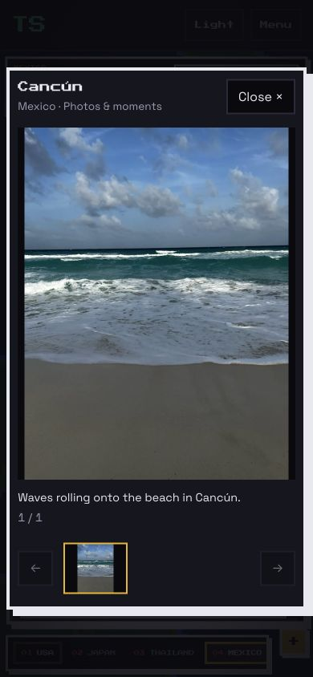
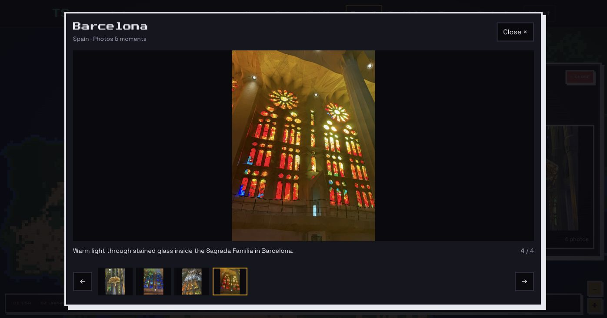

# Shared-album travel additions

This follow-up to merged PR39 adds nine reviewed still photographs across eight destinations. Cancún gets its first gallery, and a photo-established Hakuba stop gets its first gallery and map pin. Existing travel history, residence classifications, gallery controls and the existing video remain intact.

| Destination | Added photos | Resulting gallery | New subjects |
| --- | ---: | ---: | --- |
| Tokyo | 1 | 11 | Nissan race car |
| Barcelona | 1 | 4 | Warm stained glass |
| Paris | 1 | 7 | Colorful checkerboard |
| Cancún | 1 | 1 | Caribbean waves |
| Vatican | 1 | 6 | Painted gallery vault |
| Rome | 1 | 5 | Trevi Fountain at night |
| Hakuba | 1 | 1 | Snowy mountain ridges |
| Nashville | 2 | 3 | Stone clock tower and stained-glass vault |

The Nashville gallery opens with its architecture, followed by the interior and existing food photo. Existing covers elsewhere remain in place; the single-image destinations use their new image as the cover.

## Asset preparation and mapping

The new public WebP files total **3,185,128 bytes (3.04 MiB)**. The complete travel galleries now contain **189 images and one existing video across 48 destinations**, totaling **78,409,522 bytes (74.78 MiB)** including the video poster.

Each new selection was inspected at full frame, including edges, windows and reflections. All nine contain no real people. Decorative sculpture remains part of the photographed architecture. Original framing and aspect ratio are retained; no people were cropped or edited out. Public copies are oriented, converted to sRGB, limited to 1800 pixels on the long edge and compressed. EXIF, GPS, XMP and IPTC are absent from the public copies. Private downloads, provenance and rejects remain ignored.

Hakuba is independently supported by dated photo metadata and surrounding resort-sign photographs. It uses a rounded map location and a photo-established 2026 year, with zero synthetic Timeline visits, spots or dwell time. The resort location is consistent with [Hakuba47’s official access information](https://www.hakuba47.co.jp/winter/en/access/). Existing Nagano and Ōmachi records are retained separately. Nashville uses the dated shared-album sequence and visible architectural context; its selected returned copies contain no GPS. Captions avoid unsupported personal stories.

## Review coverage and remaining gaps

This was a download-first, targeted shared-album review, not an exhaustive account backup. Six album batches plus an unresolved-source inbox hold 2,458 returned files in private local manifests. JPEG contact sheets were screened first; candidate selections were then inspected at full frame.

- Europe: 673 photos screened from the requested full 714-item album; four public additions. Returned files and album item totals are not assumed equivalent.
- Mexico: 232 photos screened from the requested full 288-item album; one public addition. Playa del Carmen remains without an approved gallery.
- Japan: 774 photos screened from two requested batches covering the first 900 of 1,450 album items; two public additions. The remainder was not requested.
- Colorado: 279 photos screened from the first 300 of 1,525 items; no additional public selection.
- Nashville: all 150 photos in the requested opening batch screened, from a 1,438-item album; two public additions.
- A personal-event batch and 109 photos with unresolved album attribution were screened privately; no public selections.

Remaining shared albums, including the Las Vegas and other US album, were not exhaustively reviewed. Available disk space became low again, so further bulk requests stopped after preserving downloaded originals. Uncertain Swiss lake/glacier locations, crowd-filled scenes, near-duplicates, weak images and portraits with unconfirmed identity remain private. No new video is approved because full visual and audio review was not completed. The iCloud main Library and Google Photos were not browsed or modified in this pass.

## Validation

- Production build passed.
- All 126 unit tests passed, including canonical mapping and public asset validation.
- The existing and expanded travel browser suite passed 39 checks; the additional Nashville desktop/mobile gallery check passed separately, for 40 covered scenarios.
- Browser checks cover local image loading, gallery keyboard controls and focus return, mobile layout, map panning and zoom, reduced motion, decorative-element separation and console errors.
- Manual desktop and 390-pixel mobile inspection confirmed the new Cancún gallery. Barcelona’s new image was also inspected in the existing gallery.
- Updated expected world totals from 128 to 129 and Tokyo’s expected gallery size from 10 to 11. No map implementation changes were needed.

## Screenshots

